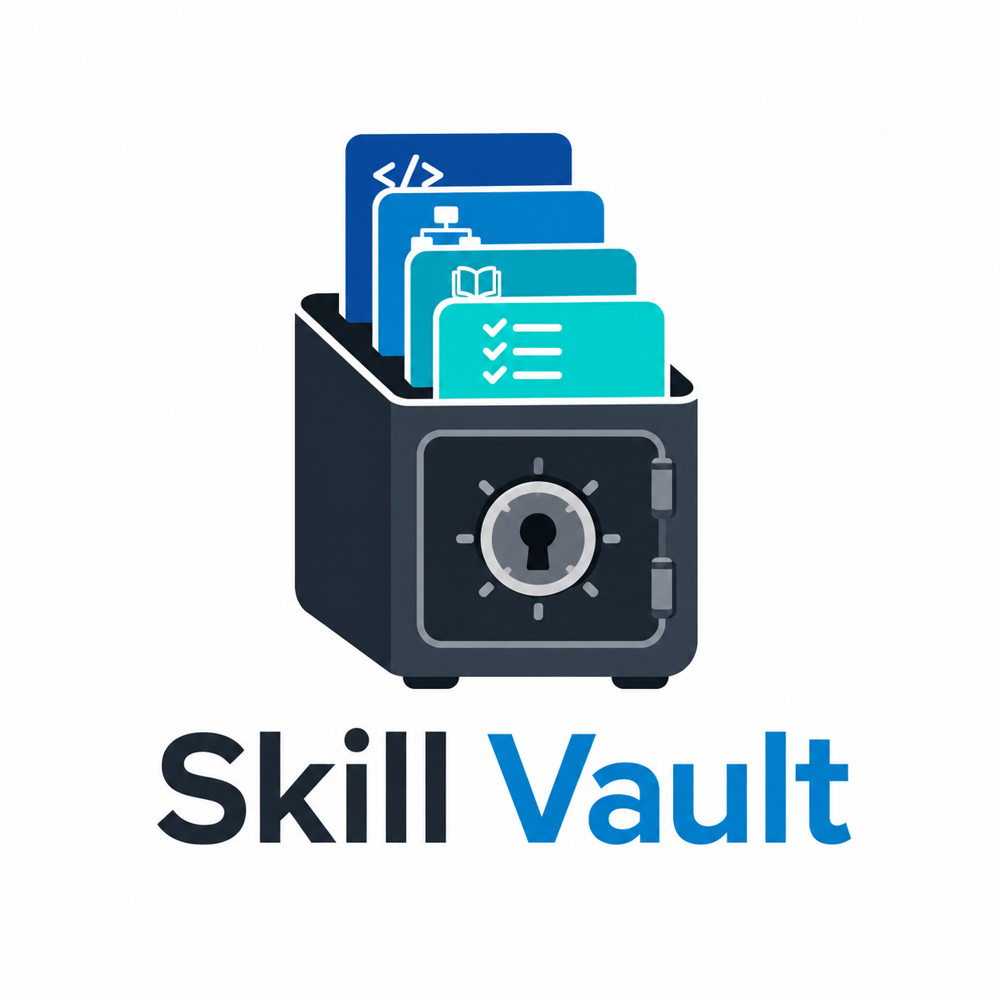

<p align="center">
  
</p>

# Skill Vault

A personal collection of agent skills, workflow references, delivery playbooks, and focused audit checklists for AI coding agents.

## Contents

### Workflow references

The Markdown files in [`skills/`](skills/) document reusable workflows for advising, batch changes, code review, deep research, goal-driven execution, verifier generation, localization, simplification, and testable frontends.

### Product delivery skills

[`skills/product-delivery-skills/`](skills/product-delivery-skills/) contains three self-contained, installable skills:

| Skill | Purpose |
| --- | --- |
| [`product-implementation-planner`](skills/product-delivery-skills/product-implementation-planner/SKILL.md) | Turn a product description and repository evidence into a phased implementation plan. |
| [`parallel-plan-implementation`](skills/product-delivery-skills/parallel-plan-implementation/SKILL.md) | Implement an approved plan through controlled, dependency-aware parallel phases. |
| [`phase-commit-reviewer`](skills/product-delivery-skills/phase-commit-reviewer/SKILL.md) | Perform a read-only, phase-aware review of one implementation commit. |

Each product-delivery skill includes its supporting references, templates, schemas, scripts, and a dedicated README.

### Audit skills

[`skills/audit/`](skills/audit/) contains focused audit playbooks. Each one is intended to produce concrete findings with file paths, line numbers, impact, and suggested fixes.

| Skill | Purpose |
| --- | --- |
| [`audit-input-validation`](skills/audit/audit-input-validation/SKILL.md) | Audit client and server validation for user-controlled input. |
| [`audit-auth-and-access-control`](skills/audit/audit-auth-and-access-control/SKILL.md) | Audit auth flows, sessions, roles, admin routes, and cross-user data isolation. |
| [`audit-secrets-and-config`](skills/audit/audit-secrets-and-config/SKILL.md) | Audit hardcoded secrets, environment validation, and webhook signatures. |
| [`audit-rate-limiting`](skills/audit/audit-rate-limiting/SKILL.md) | Audit API-route rate-limit coverage and policy fit. |
| [`audit-cors`](skills/audit/audit-cors/SKILL.md) | Audit CORS configuration and origin allowlists. |
| [`audit-database-performance`](skills/audit/audit-database-performance/SKILL.md) | Audit indexes, pagination, unbounded queries, and connection-pool risks. |
| [`audit-resilience-and-observability`](skills/audit/audit-resilience-and-observability/SKILL.md) | Audit error boundaries, external I/O, health checks, logs, and backups. |
| [`audit-asset-pipeline`](skills/audit/audit-asset-pipeline/SKILL.md) | Audit uploads, storage, CDN/object storage, and asset delivery. |
| [`audit-type-safety`](skills/audit/audit-type-safety/SKILL.md) | Audit TypeScript safety bypasses and unchecked external data. |
| [`security-review`](skills/audit/security-review/SKILL.md) | Run an umbrella security review composed from focused web skills. |
| [`ios-prelaunch-checklist`](skills/audit/ios-prelaunch-checklist/SKILL.md) | Audit iOS App Store assets, technical setup, legal readiness, and signing. |

## Use

Clone the repository and copy the skill or reference you need into the directory expected by your agent runtime:

```text
skills/product-delivery-skills/<skill-name>/SKILL.md
skills/audit/<skill-name>/SKILL.md
```

## Repository layout

```text
skills/                         Workflow references and skill material
skills/audit/                   Focused audit skills
skills/product-delivery-skills/  Self-contained product-delivery skills
LICENSE                         MIT license
```
